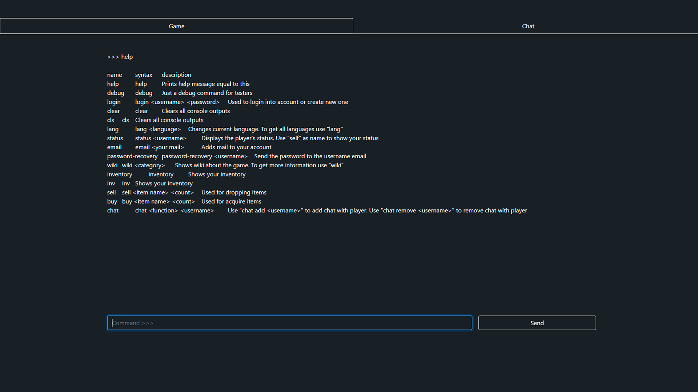
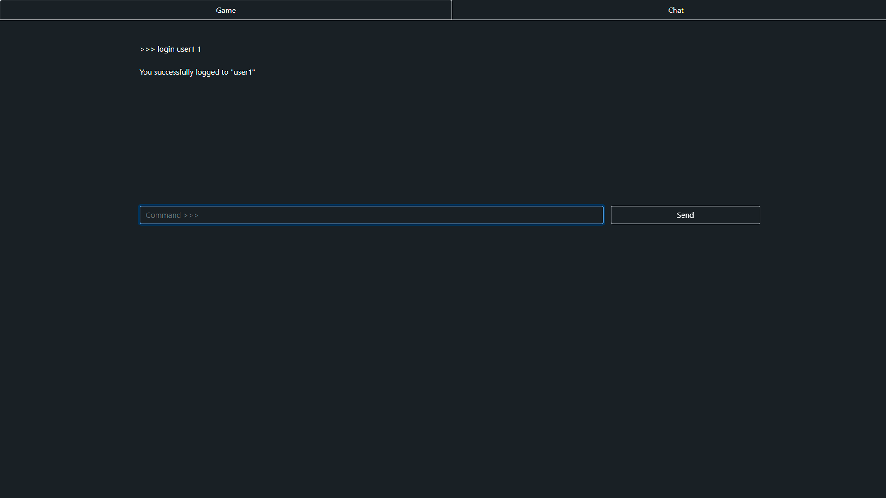
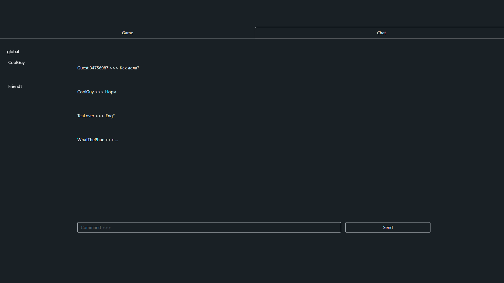

# Lambda-14

### Описание

* На стартовой странице вебсайта ("/") у пользователя есть возможности:
  - Регистрации/входа в аккаунт
  - Полного доступа к функциям сайта
  - 
* Авторизованные пользователи могут полноценно играть в нашу игру
* Если пользователь не авторизован (или не зарегистрирован), он может:
  - Просмотреть справочную информацю по проекту
  - создать/войти в аккаунт
  - Общаться в чате под именем "Guest ####"
    
* На странице чата ("/chat") можно общаться с другими игроками.
  

### Технологии в проекте

* Приложение написано на языке программирования Python c использованием микро-фреймворка flask.

* В папке templates хранятся HTML-шаблоны.
* Для работы javascript-кода, используется стороняя js библиотека jQuery.
* Для отправки/принятия запросов на/с сервера используется технология "Ajax".
* При создании форм используется html-тэг <form> и обработчик на javascript.
* Некоторые компоненты (например, панель навигации) взяты как шаблоны bootstrap.

* Веб-приложение работает с базой данных через ORM sqlalchemy.
* Регистрационные данные пользователей хранятся в базе данных SQLite main.db
* Пароли и почты хранятся в БД в закодированном виде, с использованием персонального ключа.

### Техническое описание проекта

* Для запуска приложения необходимо запустить файл app.py
* Тестовый пользователь: ya (пароль: ya)
* (Чтобы установить все зависимости достаточно в консоли (терминале) вызвать команду pip install -r requirements.txt
* Проект размещен в интернете по адресу: https://lambda-14.herokuapp.com/

### Другое

Сторонние файлы, такие как: ТЗ и скриншоты, лежат в папке "Info".
